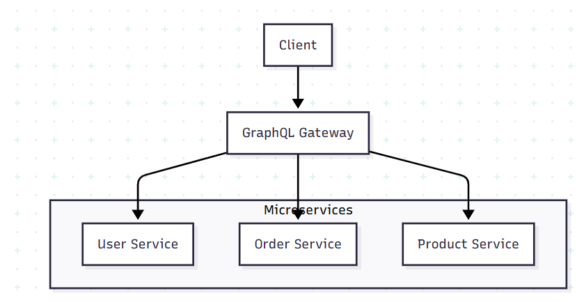

**Nama : Novera Cinthania Sindi Yonathan**

**NIM : 245410057**

## Jawaban

1.
Teorema CAP
 Consistency (C) – semua data di semua node selalu sama.
Availability (A) – sistem selalu bisa diakses.
Partition Tolerance (P) – sistem tetap berjalan meski jaringan antar server terputus.

BASE adalah pendekatan untuk sistem yang memilih AP:
Basically Available – sistem tetap merespon.
Soft State – data bisa berubah saat sinkronisasi.
Eventually Consistent – konsisten, tapi tidak harus langsung.

 Saat membuat Progresive Web App (PWA) Resep Masakan:
Aplikasi tetap bisa dipakai walau offline → Availability (A)
Data disinkronkan nanti saat online → Eventually Consistent (BASE)
Karena ada ketergantungan jaringan, otomatis memilih Partition Tolerance (P)
Artinya PWA menggunakan pendekatan AP + BASE.

2.GraphQL berfungsi sebagai API gateway yang mengkoordinasikan komunikasi antara berbagai layanan mikro (microservices) dalam sistem terdistribusi.

Cara Kerja :
Client mengirim single GraphQL query
Gateway menganalisis query dan menentukan services mana yang dibutuhkan
Gateway mengirim request ke masing-masing service yang relevan
Services mengembalikan data ke gateway
Gateway mengaggregasi data dan mengembalikan response terpadu ke client

3

4

